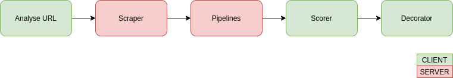

# Custom-Page-Rank

A proof-of-concept on a custom, client focused, page rank chrome extension.

*Note: The code provided is a POC, therefore expect bugs and/or technical challenges.
Tested on Ubuntu 18.04.*

## Description
Search engines that provide results to users (eg: Google search, Facebook, Twitter, etc) are great in the sense that they can quickly and effortlessly provide results, but there is zero customization when it comes to user preferences. These algorithms usually fit within the company's agenda, either to maximize ad revenue or to sell a certain product/service.

Current approaches to this problem are vast and they usually have a 
"one for all" solution such as Google's page rank or the usual Social Media "most liked comes first".

The solution presented, described in the diagram below, is a custom link filter that is customizable by the user.



* Scraper: Gets the contents of URL.
* Pipelines: Runs a series of pipelines specified by the user (eg: word-counter, sentiment-analysis, etc).
* Scorer: Attributes a score based on the received pipelines responses.
* Decorator: Applies a style to a DOM element based on the score.

## Requirements
* Google Chrome
* docker
* docker-compose

## Installation
### Backend
```bash
$ git clone https://github.com/AIFanatic/Custom-Page-Rank.git
$ cd ./Custom-Page-Rank/analyser
$ docker-compose build
$ docker-compose up
```

### Frontend
1. Go to [chrome://extensions](chrome://extensions)
2. Enable "Developer mode"
3. Click "Load unpacked" and select the "chrome-extension" directory from this repo

## Customization


The default scorer and decorator is made with an attempt to filter political and negative links.

### Pipelines
JSON describing what pipelines to run and their parameters.
```json
[
    {
        "name": "wordcounter",
        "params": {
            "text_only": true,
            "words": ["president","trump", "Trump", "senator","democrat","conservative","republican","politic","left-wing","right-wing","government"]
        }
    },
    {
        "name": "sentiment",
        "params": {
            "split_phrases": false,
            "split_phrases_threshold": 0.05
        }
    }
]
```

### Scorer
Receives a URL and the pipelines responses, returns a single number which should be the score for that particular link.
```javascript
function scorer(url, pipelines) {
    var scores = {
		"wordcounter": 0,
		"sentiment": 0
	};

	for(const pipeline of pipelines) {
		if (pipeline["name"] == "wordcounter") {
			const words = pipeline["response"];
			const wordsSum = words.reduce((a, b) => +a + +b["count"], 0);

			if (wordsSum > 3) {
				scores["wordcounter"] = -1;
			}
		}
		else if (pipeline["name"] == "sentiment") {
			const sentiment = pipeline["response"]
			scores["sentiment"] = sentiment["compound"];
		}
	}

	// Weights
	scores["wordcounter"] *= 1;
	scores["sentiment"] *= 0.5;
	score = (scores["wordcounter"] + scores["sentiment"]) / 2;

    return score;
}
```

### Decorator
Receives a DOM element and its score and applies a style to the element based on its score.
```javascript
function decorator(link, score) {
	const threshold = 0.05;
	if (score < -threshold) {
		link.style.color = "rgb(128,0,0)";
		link.style.backgroundColor = "rgba(128,0,0, 0.15)";
	}
	else if (score > threshold) {
		link.style.color = "rgb(0,128,0)";
		link.style.backgroundColor = "rgba(0,128,0, 0.15)";
	}
	else {
		link.style.color = "rgb(0,0,128)";
		link.style.backgroundColor = "rgba(0,0,128, 0.15)";
	}

    link.title = "Score: " + score
}
```

## Conclusion
Adapting an approach similar to the one presented here has a lot of benefits for internet communities in general, users can rank pages according to their own criteria, said criteria (scorers) can be shared publicly in order to provide a better rank algorithm for the less tech savvy and it reduces the backlash that companies have from steering the masses according to their own agenda. That being said, such approach has its own downfalls such as the technical complexities with implementing something like this at scale, user privacy and maybe more importantly the biases that some pipelines may have.

## References
* [The trouble with Facebook and what it has in common with scientific publishing
](https://www.youtube.com/watch?v=oDne7CBXRn0)
* [George Hotz | to organize the world's information | Science & Technology](https://www.youtube.com/watch?v=jem1unAG4_k)